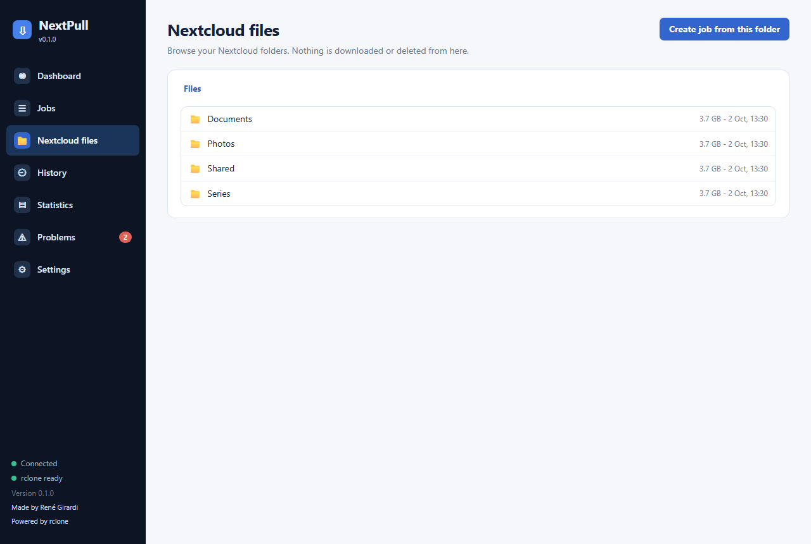
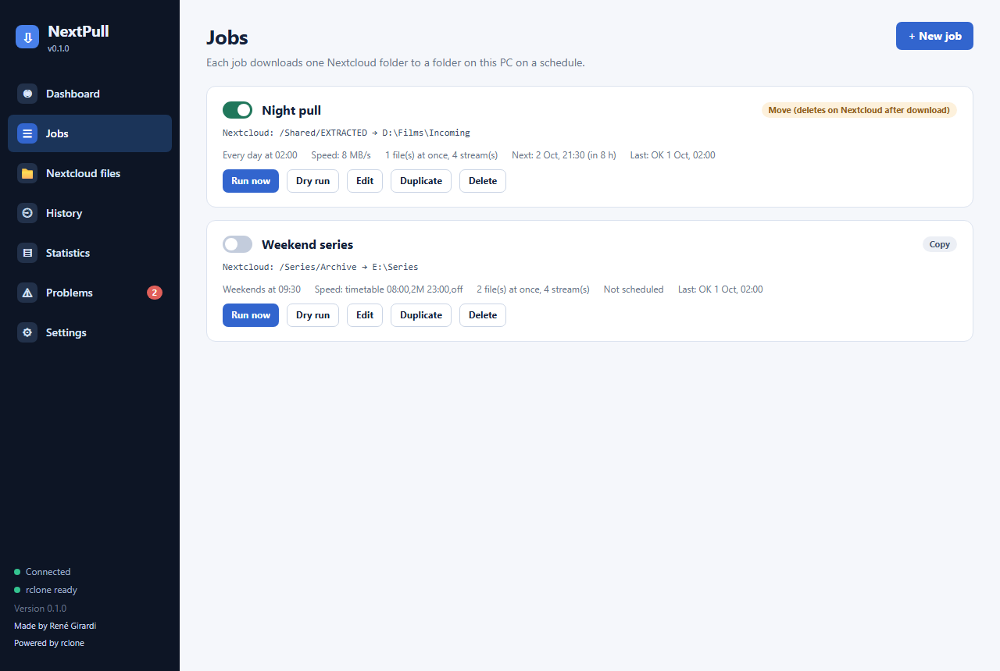
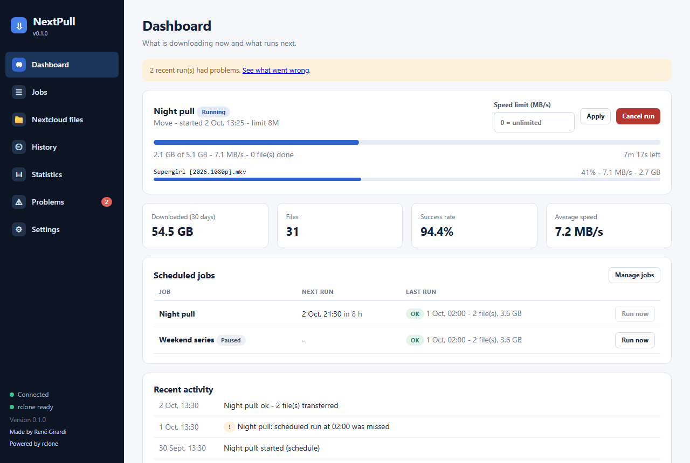

# Getting started

## 1. Connect to Nextcloud

1. Open **Settings**.
2. Type the address of your Nextcloud (for example `cloud.example.com`) and press **Connect with your browser**.
3. Your browser opens a Nextcloud page. Sign in there and press **Grant access**.
4. Back in NextPull the connection shows your name and how much of your Nextcloud space is used.

NextPull never sees your real password. Nextcloud gives it an *app password* that is stored encrypted for your Windows user, and that you can revoke any time
(**Disconnect** removes it on the server too, unless you untick that box).

## 2. Look at your files (optional)

The **Nextcloud files** page lets you browse your folders. Nothing is downloaded or deleted from there. *Create job from this folder* jumps to the job editor with the folder filled in.

## 3. Create your first job

1. Open **Jobs** and press **+ New job**.
2. **Name**: anything you like.
3. **Nextcloud folder to download**: press *Browse Nextcloud* and pick the folder.
4. **Destination folder on this PC**: pick (or type) where the files should go.
5. **What to do with the files**: choose **Copy** (keep the files on Nextcloud) or **Move** (delete them on Nextcloud after they were downloaded and verified).
6. **When**: pick the weekdays and the start time.
7. Tick **Always dry run** for the first time: NextPull then lists what *would* happen and changes nothing.
8. Save.

## 4. Try it

Press **Run now** on the job. The **Dashboard** shows the live progress: size, speed, time left and the file being transferred. You can change the speed limit or cancel from there.

Check the result in **History**. When the dry run looks right, edit the job, untick **Always dry run**, and let it run on schedule.

## 5. Let it run by itself

Turn on **Start with Windows** (and the watchdog on an always-on PC) in [Settings](Settings-and-Tray). Closing the window keeps NextPull running in the tray;
use **Quit** from the tray menu to stop it.

If something goes wrong, see [Problems and reports](Problems-and-Reports).
