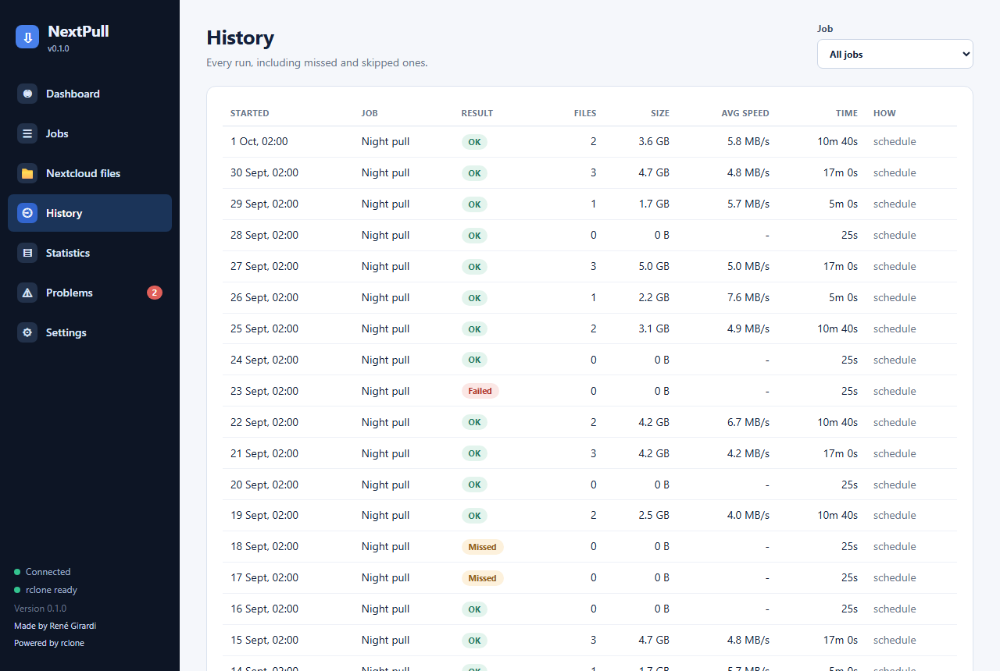
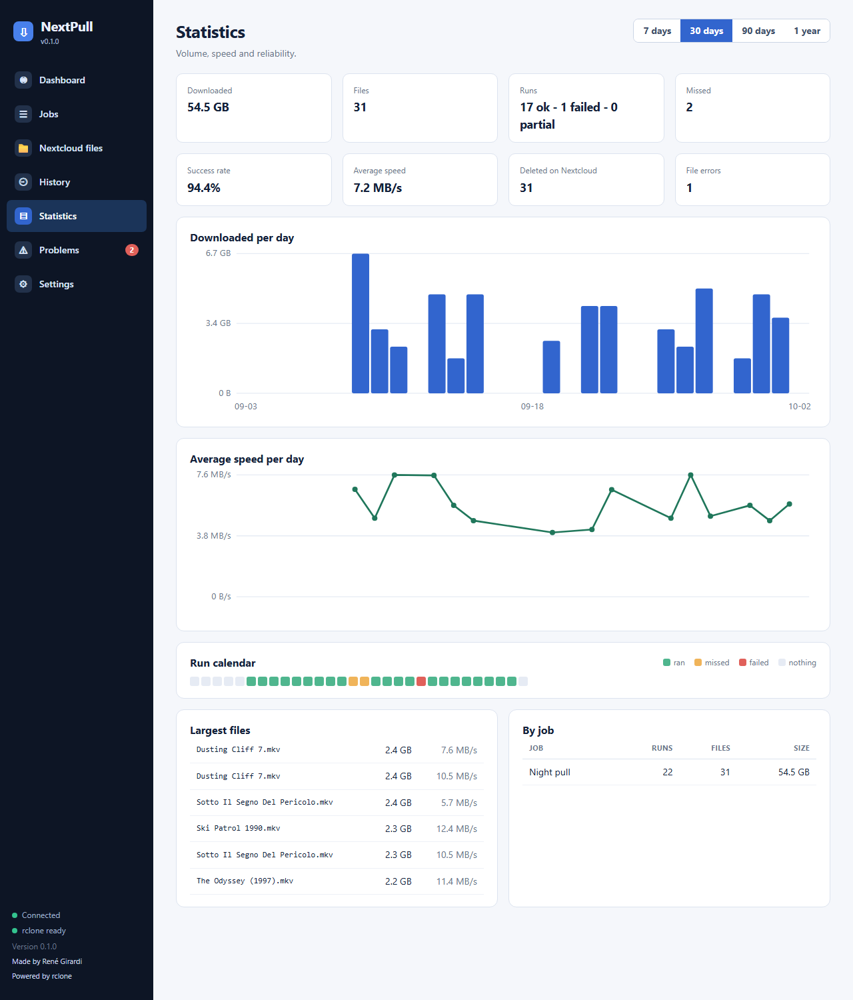

# History and statistics

## History

Every run is recorded, including the ones that never started (*Missed*, *Skipped*). Filter by job at the top right. Click a run to open its details.

A run can end as:

| State | Meaning |
| --- | --- |
| **OK** | Everything finished. |
| **Needs attention** | Mostly worked, but some files had a problem (for example downloaded but not deleted on Nextcloud). |
| **Failed** | The run could not do its job. The message gives the reason. |
| **Cancelled** / **Stopped** | You cancelled it / it reached its *Stop by* time. |
| **Missed** | The PC or NextPull was not running at the start time. |
| **Skipped** | The previous run of the same job was still going. |
| **Interrupted** | NextPull was closed or the PC shut down in the middle of the run. |

Inside a run you see each file with its size, result and speed, and the **log** (all messages, or only warnings and errors). Per-file results: *OK*, *Already had* (downloaded earlier), *Would transfer* (dry run), *Failed*, *Skipped*.

## Statistics

Totals for 7 days to 1 year: data downloaded, files, runs ok/failed/partial, missed runs, success rate, average speed, files deleted on Nextcloud, file errors; plus
a chart per day, speed per day, a calendar of runs (green ran, orange missed, red failed), the largest files and a per-job table.

History and logs are kept for the number of days set in **Settings -> Data** and pruned once a day.
