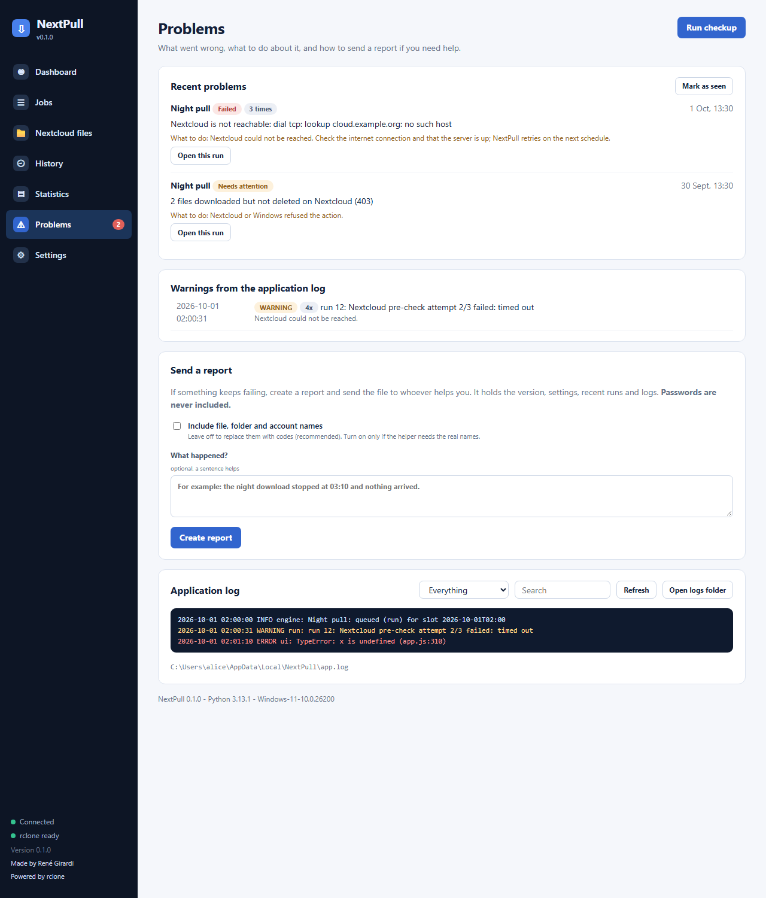

# Problems and reports

When something goes wrong NextPull tells you, in plain language, and can package everything a helper needs into one file.

## The red number

The **Problems** item in the sidebar shows a red number when runs failed since you last pressed *Mark as seen*. The Dashboard shows the same as a banner.

## The Problems page

- **Run checkup**: tests rclone, the Nextcloud login, each enabled job's Nextcloud folder and destination, free disk space, that the scheduler is alive, that the data folder is writable and whether it starts with Windows. Every problem comes with *what to do*.
- **Recent problems**: failed, partial, interrupted and missed runs of the last 7 days, grouped by job and reason, each with a hint and *Open this run*.
- **Warnings from the application log**: repeated messages are folded into one line with a count.
- **Application log**: everything NextPull itself did (startup, scheduler decisions, each run's start and end, errors), filter by level or search.

## Send a report

When something keeps failing, press **Create report**:

1. (Optional) write a sentence about what happened.
2. Leave **Include file, folder and account names** off unless the helper really needs real names.
3. Press **Create report**, then **Show in folder**, and send the `.zip` to whoever helps you.

The report contains: version and Windows version, settings, jobs, the problems list, the last checkup, recent runs, `app.log`, and the logs of the latest failed runs.

**It never contains your password or any token.** By default file and folder names, the Nextcloud address and your account name are replaced by stable codes such as `<name-3fa91c>` (the same name always gets the same code, so the report stays readable). A name that was not recognised can still appear inside an rclone message, so open the zip and look if in doubt. The newest five reports are kept in `%LOCALAPPDATA%\NextPull\reports`.

## Log files

| File | Content |
| --- | --- |
| `%LOCALAPPDATA%\NextPull\app.log` | Application log, rotated at 1 MB (6 files kept) |
| `%LOCALAPPDATA%\NextPull\logs\run-<id>.jsonl` | The raw rclone log of one run (opened by *History -> run -> Log*) |

*Settings -> Open logs folder* opens the run logs folder.
