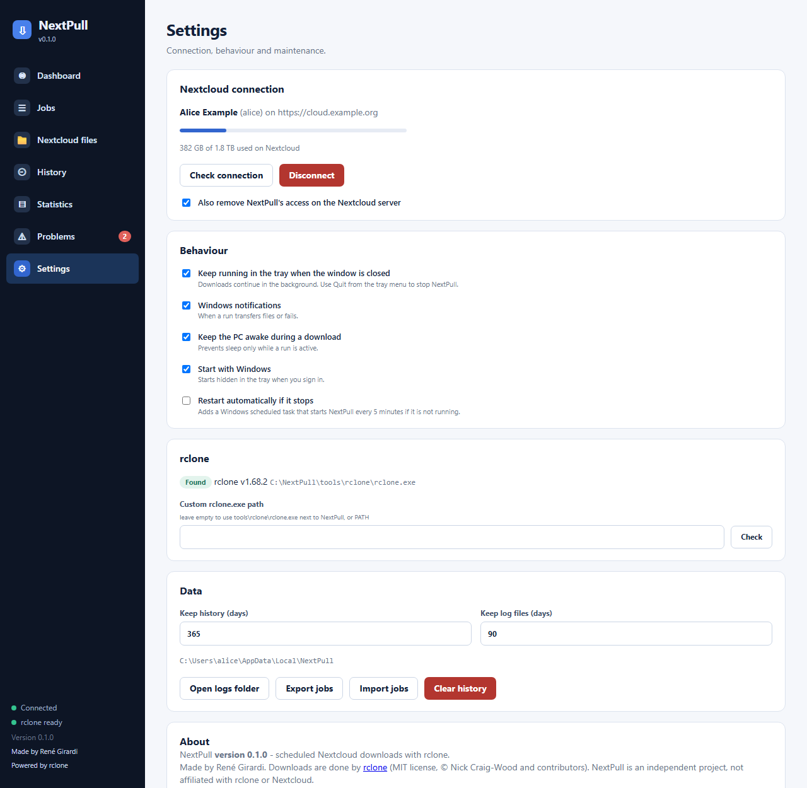

# Settings and tray

## Nextcloud connection

Connect or disconnect, check the connection, see your quota. *Disconnect* can also remove NextPull's access on the Nextcloud server (recommended).
Scheduled jobs fail until you connect again.

## Behaviour

| Setting | Effect |
| --- | --- |
| Keep running in the tray when the window is closed | Closing the window hides it; downloads continue. Use **Quit** in the tray menu to stop. |
| Windows notifications | A notification when a run transferred files or failed. |
| Keep the PC awake during a download | Prevents sleep only while a run is active. |
| Start with Windows | Starts hidden in the tray when you sign in (a per-user Run entry, no admin rights). |
| Restart automatically if it stops | A Windows scheduled task starts NextPull every 5 minutes if it is not running. |

Only one copy of NextPull runs at a time: starting it again just brings the running window to the front.

## rclone

Shows the rclone that is used and its version. Set a custom `rclone.exe` path if you do not want the bundled one.

## Data

How many days of history and run logs to keep, the data folder location, *Open logs folder*, *Export jobs* / *Import jobs* (text without passwords), *Clear history*.

## About

Version, credits (made by René Girardi) and the note that the transfers are done by [rclone](https://rclone.org).
